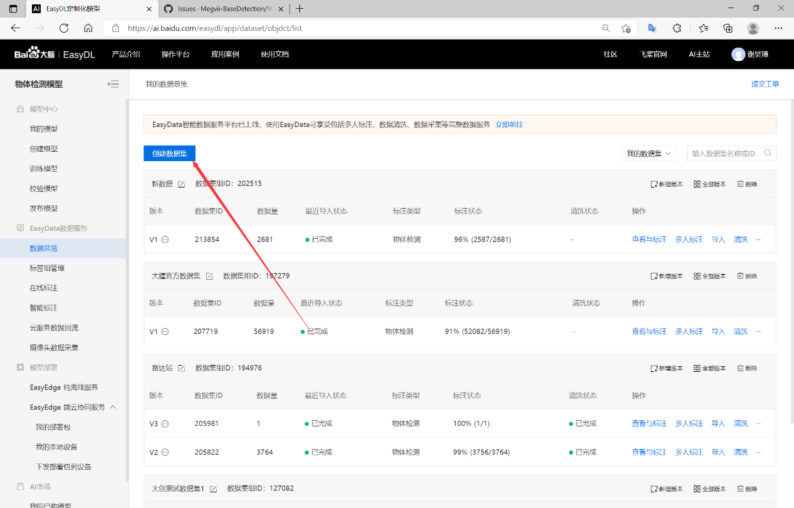
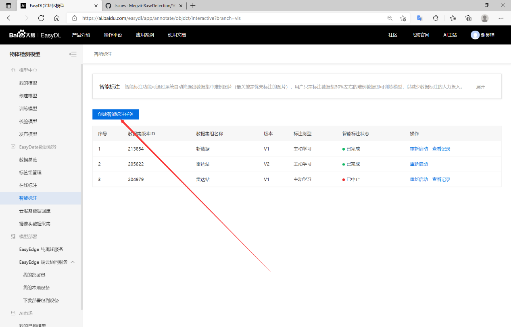
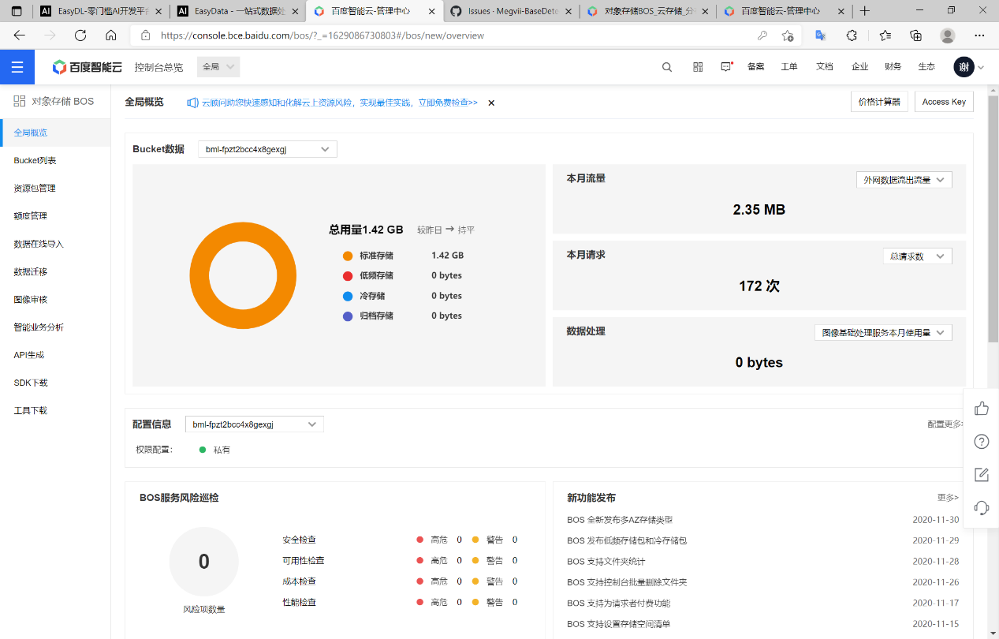

# Heimdal

## 目录

* [功能介绍](#功能介绍)

* [安装说明](#安装说明)

* [详细算法](#详细算法)

* [裁判系统通讯](#裁判系统通讯)

* [自动标注](#自动标注)

* [训练权重文件](#训练权重文件)

* [存在问题](#存在问题)

* [参与贡献](#参与贡献)

---

## 功能介绍

此代码为桂林电子科技大学Evolution战队2021年的视觉——雷达站识别代码，主要用于识别车辆位置.在Ubuntu20.04或WIN64上运行。
为了便于开发，今年我们的雷达站代码架构上和车载代码较为相似。我们雷达站今年主要功能除了给云台手提供视野，还会对哨兵进行辅助控制，
并在操作手小地图上绘制地方机器人位置。

相较于其他强校，我们的功能和逻辑还是较为简单，仅供大家参考
如果有什么问题或改进的建议，欢迎与我联系：2657618720@qq.com。

---

## 安装说明

1. 在WIN64上运行需要VS2019，在Ubuntu20.04上运行需要安装cmake。
2. 在WIN64使用时，需要下载OpenCV编译组件(OpenCV4.4.*)，百度网盘地址：（链接：https://pan.baidu.com/s/1r81tKHbLn7RWY1WvOUIiBA
   提取码：evol）——下载完成后放入Heimdal的include文件夹中即可，在Ubuntu中使用需要自行编译opencv。
3. 需要安装大华相机驱动（MV viewer 2.2.*） [下载地址](http://download.huaraytech.com/pub/sdk/)
4. 将训练好的*.weights文件放入trainData/yolo里。
5. 在WIN64运行时需根据电脑所装的CUDA和OPENCV版本编译生成相应的yolo_cpp_dll.lib，
   在Ubuntu20.04中运行时与在WIN64时相似，需根据CUDA和OPENCV版本编译生成相应的libdarknet.so放入include文件夹中
6. 不能成功运行本代码的几种解决方法（VS2019）：
    * 是否安装大华工业相机MV Viewer
    * 查看平台工具集是否是电脑上安装的版本（项目->属性->常规）
    * 查看Windows SDK版本是否是电脑上安装的版本（项目->属性->常规）
    * 查看包含目录和库目录是否配置正确
    * 查看附加依赖项是否配置正确
    * 清理解决方案（生成->清理解决方案）并重新生成解决方案

---
## 详细算法
### 1.文件结构

```
├─include									//包含路径
├─build										//生成路径
├─log										//日志文件
├─Src
│  │  main.cpp								//主函数（拉流，创建线程）
│  │      
│  ├─investigate
│  │  investigate.cpp					    //实际坐标解算
│  │  investigate.h
│  │    
│  ├─camera
│  │  │  modifyCamera.cpp					//相机设置工具类
│  │  │  modifyCamera.h
│  │  │  streamRetrieve.cpp					//相机拉流
│  │  │  streamRetrieve.h
│  │  └─   calibration
│  │           │  cameraCalibration.cpp           //单目相机标定解算
│  │           │  cameraCalibration.h
│  │           │  doubleCameraCalibration.cpp     //双目相机标定解算
│  │           │  doubleCameraCalibration.h
│  │   
│  ├─coordinateSolver
│  │  ArmorCoordinateSolver.cpp              //双目坐标解算
│  │  ArmorCoordinateSolver.h     
│  │      
│  ├─decisionLevel
│  │      decisionLevel.cpp					//决策层
│  │      decisionLevel.h
│  │      
│  ├─serial
│  │      CRC.h								//CRC工具
│  │      serial.cpp						//裁判系统通信
│  │      serial.h
│  │      
│  └─tool
│          autoSaveSample.cpp				//自动保存机器学习样本
│          autoSaveSample.h
│          filePath.h                       //文件路径
│          Conf.h							//配置文件
│          fileOperation.cpp				//文件操作辅助类
│          fileOperation.h
│          PointUtil.h						//常用操作工具类
│          RMDefine.h						//常用定义
│          RMLOG.h							//日志服务
│          systemChoose.h
│
├─TrainData                             //机器学习训练结果
│  ├─yolo  
│      │  radar.names                   //类别名称
│      │  yolov4-radar.cfg              //权重参数文件
│      │  yolov4-radar_last.weights     //训练权重
│    
├─VisionData
│  │  cameraConfigurationData.yml       //不同识别模式下的相机参数
│  │  codeSet.yml                       //代码设置
│  │  
│  ├─AVISave                            //相机录制的视频
│  ├─cameraCaliData
│  │  │  serialNumber.txt
│  │  │  标定棋盘图.jpg
│  │  │  
│  │  └─caliResults                     //相机标定结果
│  └─imgSave                            //相机拍的照片
```
### 2.雷达工作流程
1. 整体框架
   
   

2. 目标检测

我们的目标检测函数主要是在Investigate这个类里面，整个过程大致为:
      
   1)将图片转换为yolo可识别的图片格式。
   
   2)将转换好的图片放入detect_resized函数可得回目标检测到的box。

   3)为了排除误识别的可能性，我们吸取了去年电科OnePointFive的雷达站
   开发思路（在此特别鸣谢），我们增加了背景差法，并将阴影的百分比+目标检测的可能性做为最终的
   可信度，可信度我们是设置大于0.8就判定为车。
   

3. 哨兵辅助
   
   由于我方哨兵的云台旋转是180度旋转，当有对面车辆飞破过来时我们哨兵可能无法进行及时识别，所以利用
雷达站进行防守辅助。我们雷达站会根据识别到离我方哨兵距离最近距离的方位进行判断。 我们在给哨兵设置了 
四个标志位：（0-正常巡航，1-左前，2-右前，3-左后，4-右后），为了防止误识别带来的影响，我们在连续给
哨兵发送同样的方位信息多次后就会重新发送巡航命令，尽可能保证减少对哨兵的干涉，实现辅助作用。


4. 绘制小地图
      
   小地图绘制还是较为简单的只需要按照官方给出的方式，给裁判系统发送正确的信息即可，结构体我们在下面也给出样式了，只需要照着这个发送即可

---

## 裁判系统通讯
### 1.通信方式

使用USB串口与裁判系统,我们今年的裁判系统本来想使用机箱电源供电，但经过测试，过于麻烦所以改为使用外部电池供电。

### 2.通信接收结构体
依照官方给出的裁判系统通信协议来构建结构体

### 3.发送数据结构体
```cpp
//敌方机器人方位
struct ClientMapStruct {
uint8_t SOF = 0xA5;
uint16_t data_length = 14;
uint8_t seq = 0;
uint8_t CRC8;
uint16_t cmd_id = 0x0305;
uint16_t target_robot_ID;
float target_position_x;
float target_position_y;
float toward_angele;
uint16_t CRC16;
};
```

```cpp
//发送哨兵控制
struct SentryControlStruct {
uint8_t SOF = 0xA5;
uint16_t data_length = 7;
uint8_t seq = 0;
uint8_t CRC8;
uint16_t cmd_id = 0x0301;
uint16_t data_cmd_id = 0x0200;
uint16_t sender_ID;
uint16_t receiver_ID;
uint8_t orientation = 0;
uint16_t CRC16;
};
```

## 自动标注
1. 创建数据集
   
2. 导入新数据
   
3. 创建智能标注任务
   
4. 完成智能标注后在EasyData上导出标注完成的数据集
   
   
   
5.如果没有BOS的话自己创建一个，导出至BOS后打开百度云对象存储BOS。
   
   
   
   此链接即为数据集下载链接

---
   
## 训练权重文件
> 依据[YoloV4官方文档](https://github.com/AlexeyAB/darknet#how-to-train-to-detect-your-custom-objects)进行相应的配置和操作

> 我们编译的darknet是基于openCV4.5.0，CUDA11.0的环境变量，并附上了必须的dll，如果您的电脑没有这些环境变量，在运行我们的代码时就会报错。
> 您可以自己编译darknet或者配置和我一样的环境变量，或者依据你所安装版本的CUDA和openCV版本生成相应的dll或so文件

---

## 存在问题
1. 测距
   
   由于识别的问题，直接使用目标检测得出的box存在误差，会导致在远距离测距时出现较大的波动，
尤其是在超过我方半场之后双目测距偏差会极大导致，无法测出在对方半场的车辆坐标。
   
2. 训练文件
   
   由于官方训练集所给的视角缺少雷达站的方向，会造成在一些情况下无法框选出车辆，最好根据实际位置
实际角度来拍摄照片进行标注后训练，这样可以大幅度的增加识别的准确性。对于红方、蓝方和死亡的的车量标注，
样本数量最好成1:1:1，否则可能会出现将死亡车辆判别为样本数量较多的一方车辆。

---

## 参与贡献
   1. 开发人员：黎治杰、谢昊璋
   2. 特别鸣谢：李云灏、江超
